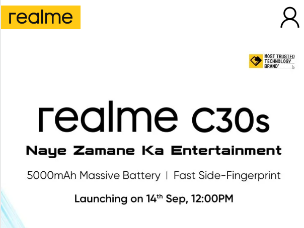

# Dom Manipulation Assignments

## Exercises:


---

1. Webiste Name: [Dev To](https://dev.to/)

### Topics

    - Query Selctory, Inner HTML

### Sample Image


### Tasks

        Target the Top description div and change the DEV Community to <Your_Name> and description to your passion

### Answer
``` js
const title = document.querySelector("aside div h2 ");
title.innerHTML = "Chandrahassan 😊";
const desc = document.querySelector("aside div p ");
desc.innerHTML = "FullStack JavaScript Developer and a DevOps Professional";

```

### Output


2. Website Name: [Apple](https://support.apple.com/en-in)

### Task


### Fetch all the product name and store in an array

### Answer
``` js
const productsList = document.querySelectorAll(
  ".row div a span.as-imagegrid-item-title"
);
let products = [];
for (let product of productsList) {
  products.push(product.textContent.replace("Support", "").trim());
}
console.log(products);
```

### Output

['iPhone', 'Mac', 'iPad', 'Watch', 'AirPods', 'Music', 'TV']

3. Webiste Name: [Youtube Support](https://support.google.com/youtube/)

### Topics

    - Get Element By Id, Create Element, Create Text Node, Append Child

### Sample Image


### Tasks

     Add another FAQ 'My New FAQ' to the list

### Answer
``` js
const list = document.querySelector(".accordion-homepage");
const section = document.createElement("section");
section.className = "parent";
const h3 = document.createElement("h3");
h3.innerText = "My FAQ";
section.append(h3);
list.append(section);
```

### Output


4. Webiste Name: [OnePlus](https://www.oneplus.in/support)

### Topics

     Query Selector, InnerText

### Sample Image


### Tasks

      Change the contact number

### Answer
``` js
const phNo = document.querySelector(".one-tel-number");
phNo.innerText = "+1234567890";

```

### Output


5. Webiste Name: [Samsung](https://www.samsung.com/in/offer/online/samsung-fest/)

### Topics

       getElementById, createElement, InnerText, append, setAttribute

### Sample Image


### Tasks

     Target the main div of card and change the Button text to Check out

### Answer
``` js
const buyNow = document.querySelectorAll(".diwali-deals-product-sale-btn");
for (let i = 0; i < buyNow.length; i++) {
  buyNow[i].innerText = "Check Out";
}
```

### Output


6. Webiste Name: [Adidas](https://www.adidas.co.in/)

### Topics

    -   Query Selector, Event listeners, Changing Styles

### Sample Image


### Tasks

     Target the search box and on hover change thebackground color to red.

### Answer
``` js
const searchBar = document.querySelector(".searchinput___19uW0");
searchBar.addEventListener("mouseenter", function () {
  searchBar.style.backgroundColor = "red";
});
```

### Output


7. Webiste Name: [MDN Web Docs](https://developer.mozilla.org/en-US/)

### Topics

       Form, Value, Submit

### Sample Image


### Tasks

     To Search a topic in the MDN Search bar.
     First add a text to search in the search bar and then hit the submit search button to search the docs using DOM

### Answer
``` js
const form = document.querySelector(".search-form");
const search = document.querySelector("#hp-search-input");
form.addEventListener("submit", function (e) {
  e.preventDefault();
  console.log(`https://developer.mozilla.org/en-US/search?q=${search.value}`);
});
```

### Output


8. Webiste Name: [Google](https://www.google.com/)

### Topics

       Remove Elements

### Sample Image


### Tasks

     Remove alternate languages from the home page languages listed

### Answer
``` js
const lang = document.querySelectorAll("#SIvCob a");
for (let la of lang) {
  la.remove();
}
```

### Output


9. Webiste Name: [Code Wars](https://www.codewars.com/)

### Topics

       Change Font Family, Color of Text.

### Sample Image


### Tasks

    Change the font family of the text to monospace and text color to the logo’s background color.

### Answer
``` js
const heading = document.querySelector(".display-heading-1");
heading.style.fontFamily = "monospace";
heading.style.color = "#B1361E";
```

### Output


10. Webiste Name: [Freecodecamp](https://www.freecodecamp.org/)

### Topics

       querySelector, mouseover, click eventListener,  callback function, style,

### Sample Image


### Tasks

    Target the button and change background colour on mouseover

### Answer
``` js
const btn = document.querySelector(
  ".btn-cta-big.btn-block.signup-btn.btn-cta.btn.btn-default"
);
const btntxt = document.querySelector(".login-btn-text");
btn.addEventListener("mouseover", function () {
  btntxt.style.backgroundColor = "#EA3323";
});
```

### Output


11. Webiste Name: [realme](https://www.realme.com/in/)

### Topics

       querySelector,style,background-image

### Sample Image



### Tasks

    change the realme logo to ineuron logo

### Answer
``` js
const logo = document.querySelector("span.icon.icon-logo.in");
logo.style.backgroundImage = `url('https://ineuron.ai/images/ineuron-logo.png')`;

```

### Output


12. Webiste Name: [Github](https://github.com/)

### Topics

       querySelector,style,background-Color

### Sample Image


### Tasks

     change the background colour of the button to blue.

### Answer
``` js
const btnNewRepo = document.querySelector("a.btn.btn-sm.btn-primary");
btnNewRepo.style.backgroundColor = "#2827CC";

```

### Output


13. Webiste Name: [Hackerrank](https://www.hackerrank.com/)

### Topics

       querySelector,innerHtml

### Sample Image


### Tasks

Target the top description and change “Matching developers with great companies” to ‘JSBOOTCAMP“.

### Answer
``` js
const hackHead = document.querySelector(".fl-heading .fl-heading-text");
hackHead.innerHTML = "JSBOOTCAMP";

```

### Output


14. Webiste Name: [Asus](https://www.asus.com/in/)

### Topics

      querySelector,style,font-size

### Sample Image


### Tasks

       change the fontsize of “Hot Deals” to 80px

### Answer
``` js
const hotdeal = document.querySelector(".HotDealsAll__Heading__2fIbe");
hotdeal.style.fontSize = "80px";
```

### Output


15. Webiste Name: [Dell](https://www.dell.com/en-in/shop/deals/laptop-deals?gacd=10415953-9016-5761040-285981356-0&dgc=ST&gclid=Cj0KCQjwguGYBhDRARIsAHgRm4-XUDMhhVNyHXb3s1gY4ZBzORr_d9Se-buhJwy7asyUe7YdqEA11eEaAt6UEALw_wcB&gclsrc=aw.ds&nclid=BxjBlpBQsX6pjSHh-L8YYSU77EpfXRkG1AGMB5Wbeu386ykspfrPDnfx_DdFau20)

### Topics

      querySelector,style.textAlign

### Sample Image


### Tasks

       Convert the text “G15 Gaming Laptop” from left to right

### Answer
``` js
const dellLapName = document.querySelectorAll(".ps-title");
for (let lap of dellLapName) {
  if (lap.innerText == "G15 Gaming Laptop") {
    lap.style.textAlign = "right";
  }
}
```

### Output


16. Webiste Name: [Vercel](https://vercel.com/)

### Topics

     querySelector,innerHTMl

### Sample Image


### Tasks

      change the heading “Start with the developer” to “Start with Scratch”

### Answer
``` js
const vercelHead = document.querySelector(".section-title_title__VEDfK");
vercelHead.innerHTML = "Start with Scratch";
```

### Output


17. Webiste Name: [Sony](https://www.sony.co.in/)

### Topics

    querySelector,innerHTMl

### Sample Image


### Tasks

     change the button text To current Date.

### Answer
``` js
const sonybtn = document.querySelector(".PrimaryTout__ButtonText");
sonybtn.innerText = new Date();
```

### Output


18. Webiste Name: [Philips](https://www.philips.co.in/)

### Topics

     querySelector,style,backgroundcolor

### Sample Image


### Tasks

    change the background colour blue to orange

### Answer
``` js
const philips = document.querySelector(".p-f03-footer-container");
philips.style.background = "orange";
```

### Output


19. Webiste Name: [Canon](https://in.canon/)

### Topics

          querySelector,src

### Sample Image


### Tasks

    extract the canon logo

### Answer
``` js
const canon = document.querySelector(".navbar-brand img");
const source = canon.getAttribute("src");
console.log(`${location.href}${source}`);
```

### Output


20. Webiste Name: [Oppo](https://www.oppo.com/in/)

### Topics

          querySelector,style,color

### Sample Image


### Tasks

      Change the description colour black to orange

### Answer
``` js
const oppo = document.querySelector(".wide h3");
oppo.style.color = "orange";
```

### Output


